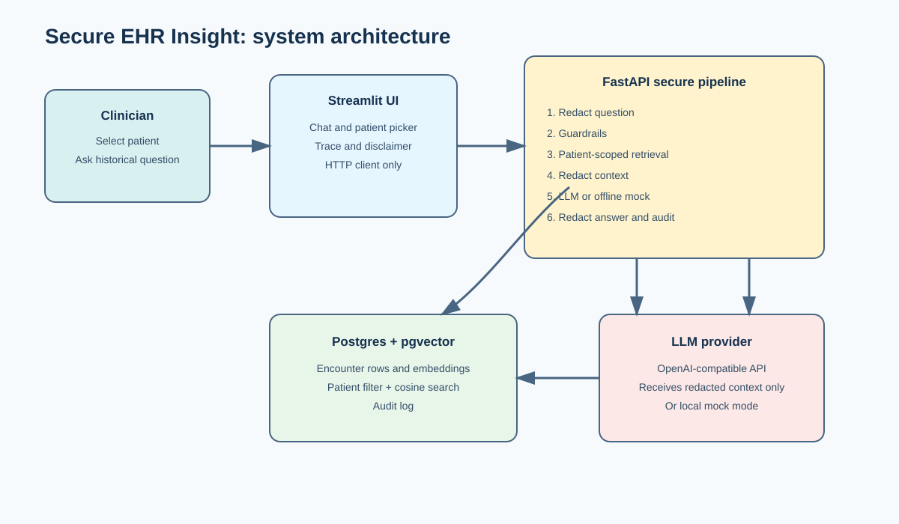
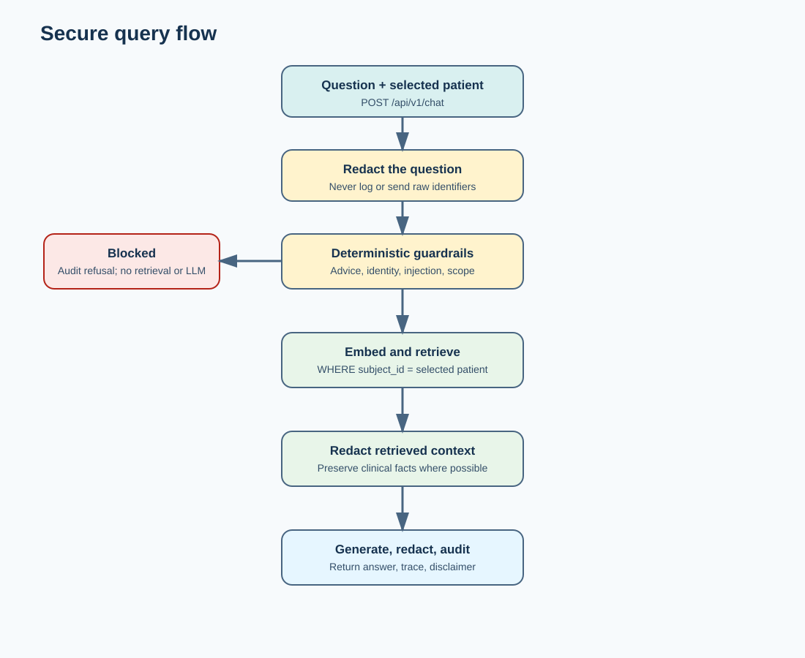
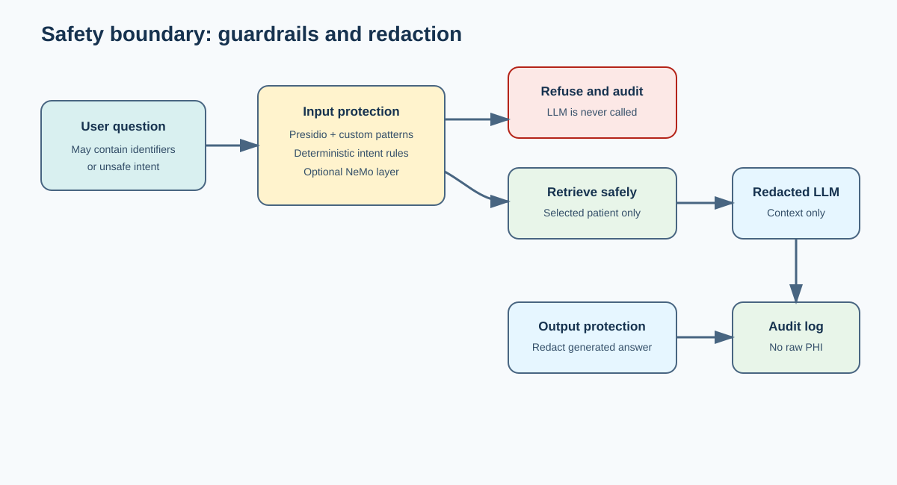
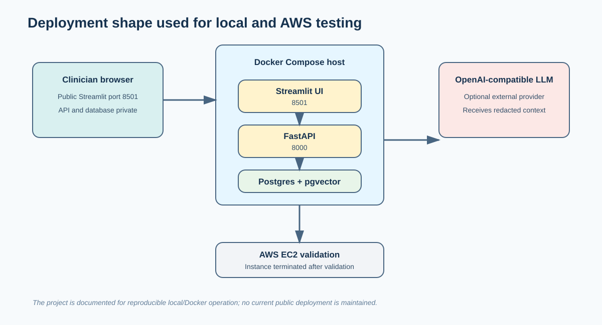

# 🩺 Secure EHR Insight & Clinical Validator

> Privacy-conscious natural-language retrieval over patient records. Select one patient, ask about historical clinical facts, and receive an answer from patient-scoped records with PHI redaction, safety guardrails, and audit logging.

▶️ **[Watch the AWS deployment and application demo on YouTube](https://youtu.be/zgjYudpCnAE)**

[](https://www.python.org/)
[](https://fastapi.tiangolo.com/)
[](https://streamlit.io/)
[](https://github.com/pgvector/pgvector)
[](https://www.docker.com/)
[](https://github.com/sivamani-muraboyina/dr_keeper/actions/workflows/ci.yml)

> ⚠️ This is a reference implementation using 100% synthetic data. It is not a HIPAA certification, production clinical software, or a substitute for clinical judgment.

---

## 🚀 Deployment Status

The application was deployed and tested on AWS during development. The instance was terminated after recording the demonstration to avoid ongoing infrastructure costs. There is no maintained public deployment currently.

The project remains reproducible locally with Docker. Streamlit Community Cloud cannot host the complete FastAPI, Postgres, and pgvector stack as one application without a separate backend and database deployment.

## 👔 For Reviewers — Try It Locally

1. Start the Docker stack with `docker compose up --build`.
2. Open the Streamlit UI at `http://localhost:8501`.
3. Select a synthetic patient.
4. Ask *"What medications were recorded for this patient?"*.
5. Toggle the pipeline trace to inspect retrieval, redaction counts, and latency.
6. Try *"Should I increase the dose?"* or *"What is the patient's phone number?"* to see guardrails refuse unsafe requests.

> **Capabilities:** patient-scoped vector retrieval, PHI redaction before and after generation, deterministic guardrails, optional LLM integration, audit logging, Docker packaging, and reproducible evaluation.

---

## 🧩 Problem

Clinical records are valuable but difficult to inspect quickly. A natural-language interface can help clinicians find historical facts, but a safe implementation must address four constraints:

- Patient data must not be sent raw to an external LLM.
- Retrieval must not mix records from different patients.
- The assistant must retrieve history, not diagnose or prescribe.
- Requests and safety decisions must be auditable.

## 💡 Solution

The application combines a Streamlit interface, a FastAPI backend, Postgres with pgvector, Presidio/spaCy redaction, deterministic guardrails, and an optional OpenAI-compatible LLM.



For every question, the backend:

1. Receives a selected patient and the conversation history.
2. Redacts identifiers from the question.
3. Blocks medical advice, identity requests, prompt injection, and unrelated questions before retrieval or generation.
4. Embeds the question and searches only the selected patient's encounters.
5. Redacts retrieved context before it reaches the LLM.
6. Generates an answer using the offline mock or configured LLM provider.
7. Redacts the answer again and writes a PHI-safe audit event.



## Safety Boundary



The default offline mode does not require an LLM API key. The optional provider mode supports OpenAI-compatible endpoints such as Groq, OpenAI, DeepSeek, Ollama, or vLLM. Only redacted context is sent downstream by the application, but provider terms and organizational policy still require review.

## ✨ Features

### 🔒 Privacy and Safety

- **PHI redaction** using Presidio, spaCy, custom SSN/MRN/address recognizers, clinician-title rules, and a hospital deny-list.
- **Defense in depth** with redaction on the question, retrieved context, conversation history, and generated answer.
- **Deterministic guardrails** for medical advice, diagnosis, identity requests, prompt injection, empty questions, and unrelated requests.
- **Optional NeMo Guardrails** as a second experimental safety layer.

### 🔎 Patient-Scoped Retrieval

- **Postgres + pgvector** keeps embeddings beside the existing encounter rows.
- **Patient-first filtering** prevents semantically similar records from another patient from entering the answer context.
- **Configurable embeddings** with an offline hash backend or an optional biomedical sentence-transformer backend.
- **Audit logging** records redacted questions, decisions, categories, row counts, and redaction counts.

### ⚡ Application Infrastructure

- **FastAPI backend** for the protected pipeline and API contract.
- **Streamlit frontend** for patient selection, chat history, and an inspectable pipeline trace.
- **Offline mock LLM** for local development and CI without API keys or model costs.
- **OpenAI-compatible LLM support** for providers such as Groq, OpenAI, DeepSeek, Ollama, or vLLM.
- **Docker Compose** for Postgres/pgvector, API, and UI startup.

## Design Decisions

The full rationale, alternatives, and trade-offs are documented in [docs/DESIGN_DECISIONS.md](docs/DESIGN_DECISIONS.md). Important examples:

- **Postgres remains the source of truth:** moving EHR rows to a separate vector database would add synchronization, access-control, backup, and operational cost.
- **pgvector instead of a separate vector service:** embeddings stay beside encounter rows, so patient filtering and cosine search happen in one database query.
- **Patient filtering before ranking:** this is a safety boundary as well as a performance optimization.
- **Hash embeddings by default:** local development and CI work without model downloads, GPUs, or API costs; semantic biomedical embeddings remain optional.
- **Redaction before and after generation:** this protects both the LLM boundary and the returned answer, while acknowledging that automated redaction is not perfect.
- **Deterministic guardrails first:** unsafe requests are rejected without retrieval, model calls, or model cost.

## 🏗️ Architecture

- [System architecture diagram](docs/diagrams/system-architecture.svg)
- [Secure query flow](docs/diagrams/secure-query-flow.svg)
- [Guardrail and redaction flow](docs/diagrams/guardrail-redaction-flow.svg)
- [Docker and AWS deployment shape](docs/diagrams/docker-aws-deployment.svg)
- [Detailed design decisions and trade-offs](docs/DESIGN_DECISIONS.md)
- [Architecture notes](docs/ARCHITECTURE.md)
- [Compliance and limitations](docs/COMPLIANCE_AND_LIMITATIONS.md)

## 🚀 Quick Start (Local)

Docker Compose starts Postgres/pgvector, the FastAPI service, and Streamlit:

```bash
cp .env.example .env
docker compose up --build
```

Open:

| Service | URL |
|---|---|
| Streamlit UI | http://localhost:8501 |
| FastAPI | http://localhost:8000 |
| Swagger API docs | http://localhost:8000/docs |



## Local Setup Without Docker

Requirements: Python 3.12, Postgres 14 or newer, and the pgvector extension.

```bash
python -m venv .venv

# Windows PowerShell
.venv\Scripts\Activate.ps1

# macOS/Linux
source .venv/bin/activate

pip install -r requirements.txt
python -m spacy download en_core_web_lg
```

Copy `.env.example` to `.env`, update `DATABASE_URL` if needed, then bootstrap the synthetic data:

```bash
python scripts/bootstrap.py
```

Start the API and UI in separate terminals:

```bash
PYTHONPATH=src python -m uvicorn ehr.api:app --port 8000
PYTHONPATH=src python -m streamlit run ui/app.py
```

## ⚙️ Configuration

| Variable | Default | Purpose |
|---|---|---|
| `DATABASE_URL` | local Postgres URL | Postgres connection string |
| `EMBED_BACKEND` | `hash` | `hash` for offline lexical vectors or `st` for semantic embeddings |
| `EMBED_MODEL` | biomedical model name | Sentence-transformer model when `EMBED_BACKEND=st` |
| `SPACY_MODEL` | `en_core_web_lg` | NER model used by Presidio |
| `LLM_PROVIDER` | `mock` | `mock` for offline extraction or `openai` for an OpenAI-compatible endpoint |
| `LLM_BASE_URL` | DeepSeek URL | Provider base URL when using `openai` mode |
| `LLM_API_KEY` | empty | Provider key; never commit it |
| `LLM_MODEL` | `deepseek-chat` | Provider model name |
| `TOP_K` | `8` | Number of patient encounters retrieved |
| `USE_NEMO` | `false` | Enable the optional second guardrail layer |
| `API_KEY` | empty | Optional API authentication header |

## 📡 API Endpoints

| Method | Endpoint | Description |
|---|---|---|
| `GET` | `/health` | Database and configuration health check |
| `GET` | `/api/v1/patients` | List patients with embedded encounters |
| `POST` | `/api/v1/chat` | Run the protected retrieval pipeline |
| `GET` | `/api/v1/audit` | Read recent audit events |
| `GET` | `/docs` | FastAPI Swagger documentation |

## 📊 Testing and Evaluation

```bash
make test
make eval
```

The repository includes unit tests for redaction, guardrails, embeddings, and the API pipeline. The evaluation script measures planted-identifier redaction, guardrail decisions, clinical-text preservation, and latency on the synthetic dataset.

## 🛠️ Tech Stack

| Layer | Technology |
|---|---|
| **Frontend** | Streamlit |
| **Backend** | FastAPI + Uvicorn |
| **Database** | PostgreSQL + pgvector |
| **Redaction** | Presidio + spaCy |
| **Guardrails** | Deterministic rules + optional NeMo Guardrails |
| **Embeddings** | Deterministic hash vectors or biomedical sentence-transformers |
| **LLM** | Offline mock or OpenAI-compatible provider |
| **Deployment** | Docker Compose; AWS tested during development |

## 📚 Documentation

- [Design decisions and trade-offs](docs/DESIGN_DECISIONS.md)
- [Architecture notes](docs/ARCHITECTURE.md)
- [Compliance and limitations](docs/COMPLIANCE_AND_LIMITATIONS.md)
- [Validation runbook](docs/VALIDATION_RUNBOOK.md)
- [AWS deployment notes](docs/AWS_DEPLOYMENT.md)

## 📁 Project Structure

```text
src/ehr/                  Backend configuration and secure pipeline
src/ehr/api.py            FastAPI endpoints
src/ehr/pipeline.py       Guard, retrieve, redact, generate, audit flow
src/ehr/retrieval.py      Patient-scoped pgvector search
src/ehr/redaction.py      Presidio/spaCy PHI redaction
src/ehr/guardrails.py     Deterministic safety rules
ui/app.py                 Streamlit interface
scripts/                  Synthetic data, ingestion, embeddings, evaluation
tests/                    Unit and integration tests
docs/diagrams/            Version-controlled SVG architecture diagrams
docs/DESIGN_DECISIONS.md  Problem statement and technical trade-offs
```

## ⚠️ Known Limitations

- All included records are synthetic.
- The hash embedding backend is lexical, not semantic.
- Redaction has false positives and false negatives.
- The optional API key is not enterprise authentication or authorization.
- Audit events do not include a real authenticated clinician identity.
- Local state and the demo deployment are not designed for high availability.
- NeMo Guardrails is experimental and disabled by default.

See [docs/COMPLIANCE_AND_LIMITATIONS.md](docs/COMPLIANCE_AND_LIMITATIONS.md) before adapting this project for any real clinical data.
